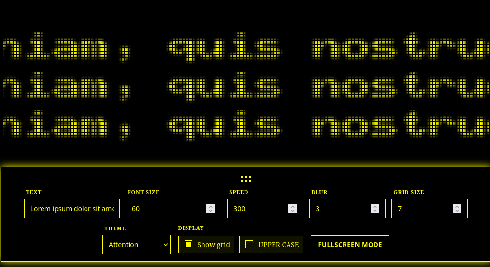

# Creeping Line

Show your message with taste!
Creeping Line is a React + Vite playground for animated ticker text, live theme switching, and fullscreen presentation mode.


## Demo

<video src=".docs/video/video.mp4" controls autoplay muted loop playsinline width="100%"></video>

If your viewer cannot play embedded video, open it directly:
[`docs/video/video.mp4`](docs/video/video.mp4)

## Screenshots




## Why Creeping Line

- Change text in real time without reloading the page
- Live control panel for speed, blur, font size, grid, and casing
- Built-in theme picker powered by `src/assets/colorSchemes.json`
- Full screen mode for displaying text without unnecessary clutter
- State persistence in `localStorage` to keep your last setup
- Line doesn't move when text fits the screen

## Table of Contents

- [Quick Start](#quick-start)
- [Scripts](#scripts)
- [Customization](#customization)
- [Deployment](#deployment)
- [Project Structure](#project-structure)
- [Roadmap](#roadmap)
- [License](#license)

## Quick Start

### Requirements

- Node.js 18+
- npm

### Install and run

```bash
npm install
npm run dev
```

Open the local URL shown by Vite (typically `http://localhost:5173`).

## Scripts

```bash
npm run dev      # Start development server
npm run build    # Build production bundle into dist/
npm run preview  # Preview the production build locally
npm run lint     # Run ESLint
```

## Customization

### Theme system

Themes are defined in [`src/assets/colorSchemes.json`](src/assets/colorSchemes.json).
Each theme contains:

- `name`
- `baseColor`
- `accentColor`

Add your own theme by appending a new object to the array.

### Controls panel

The UI controls live in [`src/components/Controls.jsx`](src/components/Controls.jsx), including:

- Text input
- Font size
- Speed
- Blur radius
- Grid toggle and grid size
- Uppercase toggle
- Theme selector
- Fullscreen trigger

## Deployment

Build the app:

```bash
npm run build
```

Then deploy the contents of `dist/` to any static host (Nginx, Netlify, Vercel, GitHub Pages, etc.).

If you host under a subpath (for example `/line/`), set Vite `base` in [`vite.config.js`](vite.config.js) before building.

## Project Structure

```text
src/
  assets/
    colorSchemes.json
    video/video.webm
  components/
    Controls.jsx
    creepingLine.jsx
  hooks/
    useFullscreen.ts
  App.jsx
```

## Roadmap

- Preset export/import (JSON)
- Better mobile control ergonomics
- Improved theme picker


## License

This project is licensed under the **MIT License**.


